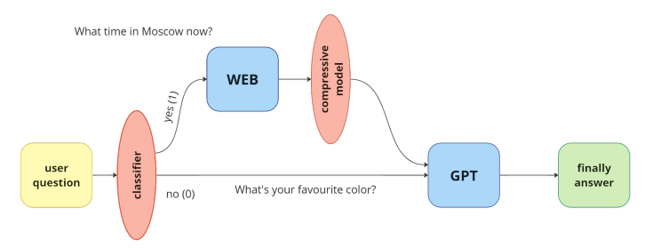

# WebGPT

An innovative bot for human-like communication using the Internet. Thanks to Internet access, this GPT model can give an up-to-date answer to any of your questions.

## How it work
### Architecture of the neural network system:



## TG bot

### Installation

```sh
git clone "https://github.com/SpomJ/WebGPT.git"
cd WebGPT
pip install -r requirements.txt
```

### Usage:

```sh
python src/tg_bot_source.py
```


Open telegram, go to `@WebGPTboBOT` and enter your prompt.


